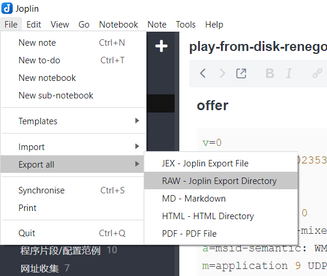

# joplin2obsidian

## What is joplin2obsidian?
joplin2obsidian is a conversion tool to help you making the move from Joplin to Obsidian

## How to use
1. Firstly, Open Joplin, export all data (*notes and corresponding resources*) as RAW to a directory

2. Run joplin2obsidian to convert the "RAW - Joplin Export Directory" to Oobsidian-Compatible vault directory 
~~~bash
Usage of joplin2obsidian:
  -s string
        Specify the source directory where Joplin exported the RAW data
  -d string
        The destination directory of Obsidian vault
~~~

3. Open the destination directory as vault in Obsidian

Done!

## Build from source
~~~bash
$ git clone https://github.com/luxi78/joplin2obsidian.git
$ cd  joplin2obsidian
$ make
$ cd dist
~~~
